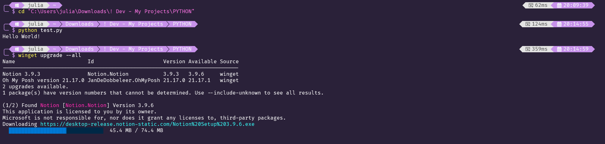

<h1 align="center">Synthwave Terminal Theme</h1>



## Styling

### Windows Terminal Themes
- https://windowsterminalthemes.dev/
- Install **synthwave-everything** by [RobbOwen](https://github.com/robb0wen) to your Windows Terminal

### Oh My Posh
- https://ohmyposh.dev/
- Use my modified theme of **quick-term**, get it [here](https://github.com/CtrlAltDelicious0/synthwave-terminal-theme/blob/main/.%20Quick%20Term%20Theme/quick-term.omp.json)
- Download it then replace the original : `C:\Users\AppData\Local\Programs\oh-my-posh\themes\quick-term.omp.json`
- Open up your oh-my-posh profile then paste this in:
```
oh-my-posh init pwsh --config "$env:POSH_THEMES_PATH/quick-term.omp.json" | Invoke-Expression
```
> [!IMPORTANT]
> Updating oh-my-posh installs the default themes so just redownload the json to the same directory mentioned above.

### Nerd Fonts
- https://www.nerdfonts.com/font-downloads
- Download **FiraCode Nerd Font** and use it in your terminal

## Credits
- [RobbOwen](https://github.com/robb0wen)
- [Original quick-term theme](https://github.com/JanDeDobbeleer/oh-my-posh/blob/main/themes/quick-term.omp.json)
